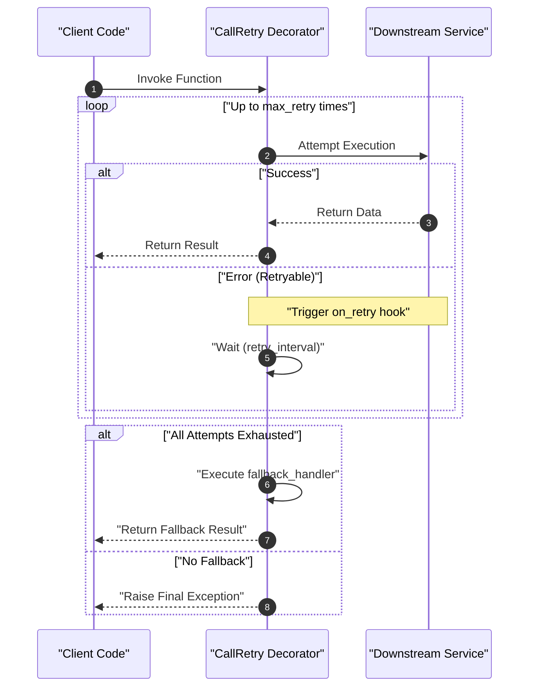
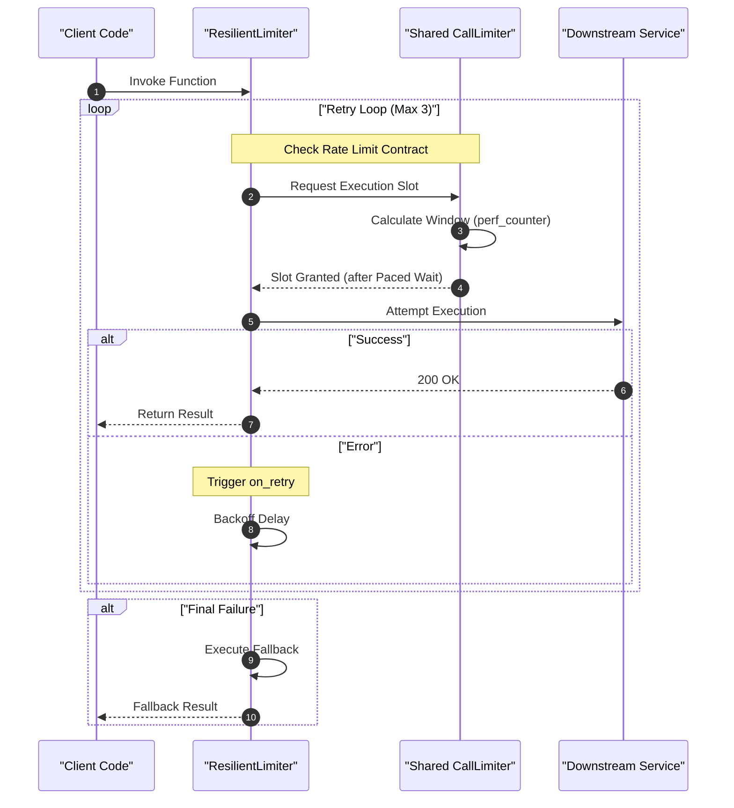

# call-limiter ⏱️♻️🛡️

[](https://pypi.org/project/call-limiter/)
[](https://call-limiter.readthedocs.io/en/latest/?badge=latest)
[](https://github.com/eyukselen/call-limiter/actions)
[](https://pypi.org/project/call-limiter/)
[](https://opensource.org/licenses/MIT)

A high-precision concurrency control library for distributed systems resilience.


## ✨ Key Features

* Low-Jitter Timing: Uses time.perf_counter() and resolution-aware sleeping to prevent the "creeping delays" common in standard rate limiters.
* Dynamic Jitter Compensation: Automatically adjusts for OS-level scheduling delays to ensure time.sleep intervals remain precise under heavy system load.
* Thread-Safe: Designed for multithreaded environments where multiple workers hit the same limited resource.
* Thread-Synchronized State: Shared locks ensure that 10 threads hitting the same limiter behave as a single unit.
* Synchronized Pacing: In hybrid mode, retries are queued through the global limiter, preventing a 'thundering herd' and ensuring you never exceed your quota during recovery.

---
## 📦 Core Components

* ⏱️ **CallLimiter**: A high-precision throttler that paces function calls to stay within specific rate limits.


<details>
<summary><b>⏱️ View Throttling Strategy Diagram</b></summary>

```
Burst mode for 5 calls per 10 seconds:  
Time (s)  0              5              10                            20
          |-----|-----|-----|-----|-----|-----|-----|-----|-----|-----|-----  
Call-1    [████]                        |                             |
Call-2    [█████]                       |                             |
Call-3    [██]                          |                             |
Call-4    [█████]                       |                             |
Call-5    [█]                           |                             |
Call-6                                  |[████]                       |  
Call-7                                  |[█████]                      |       
Call-8                                  |[██]                         |        
Call-9                                  |[█████]                      |     
Call-10                                 |[█]                          |     

Drip mode for 5 calls per 10 seconds:
Time (s)  0              5              10                            20
          |-----|-----|-----|-----|-----|-----|-----|-----|-----|-----|
Call-1    [████]                        |                             |
Call-2          [█████]                 |                             |
Call-3                [██]              |                             |
Call-4                      [█████]     |                             |
Call-5                            [█]   |                             |
Call-6                                  |[████]                       | 
Call-7                                  |      [█████]                |
Call-8                                  |            [██]             |
Call-9                                  |                 [█████]     |
Call-10                                 |                       [█]   |
```
</details>


* ♻️ **CallRetry**: A resilience decorator that re-runs failed functions with a configurable delay and exception handling.

<details>
<summary><b>⏱️ View Retry Strategy Diagram</b></summary>



</details>

* 🛡️ **ResilientLimiter**: A hybrid solution that combines pacing with Coordinated Recovery, ensuring retries never exceed your defined rate limit across threads.

<details>
<summary><b>⏱️ View Resilient Strategy Diagram</b></summary>



</details>

## 🛠 Installation

```
pip install call-limiter
```

---

## Usage

### Component 1: ⏱️ CallLimiter  

**Scenario:** I want to "rate limit" (throttle) my function so it limits my calls to 5 calls per second. I also want to have an option to select if I want 5 calls to fire instantly or spread across evenly in the 1 second period.

**Usage-1: 5 calls per 1 second with burst (instantly fire all 5 calls)**
*Best for: Maximizing throughput when the target API allows short spikes.*

**My function to throttle:** `my_function`

```python
from call_limiter import CallLimiter

limiter = CallLimiter(calls=5, period=1, allow_burst=True)
throttled_func = limiter(my_function)
```

**Usage-2: 5 calls per 1 second paced (evenly spread calls)**
*Best for: Avoiding "spiky" traffic patterns that trigger anti-bot protections.*

```python

from call_limiter import CallLimiter

# This forces a call exactly every 0.2 seconds (1s / 5 calls)
limiter = CallLimiter(calls=5, period=1, allow_burst=False)
throttled_func = limiter(my_function)
```

---
### Component 2: ♻️ CallRetry

**Scenario:** I want a retry logic to use with my function calls. 
If `my_function` raises ValueError exception, it should retry up to 5 times with 1-second delay between attempts.
I want to log every retry with `retry_logger` function.
if it still fails, it should use `fail_handler` function. (if not provided, raise error)

```python
from call_limiter import CallRetry

# This configuration perfectly mirrors your scenario:
retry = CallRetry(
    retry_count=5,
    retry_interval=1.0,
    retry_exceptions=(ValueError,), # Trigger
    on_retry=retry_logger,           # Observability
    fallback=fail_handler            # Outcome (Plan B)
)

# If fail_handler is a function, this returns its result on ultimate failure.
# If you didn't pass fail_handler, it would raise the ValueError.
resilient_func = retry(my_function)
```

---
### Component 3: 🛡️ ResilientLimiter
**Scenario:** I want a rate limiter that can also handle failed calls. `my_function` should be called  
Flow Logic:
* 5 calls/per second with burst (or drip), 
* max_retry = 3 (if it fails) 
* on_retry=`retry_handler`, notify me by calling optional `retry_handler`, if not provided ignore!
* fallback=`falback_handler` if it still fails notify me, if not provided raise error!
Note: each retry will comply "5 calls/per second with burst (or drip)" tempo to respect rate limiter  
Note: on_retry receives (exception, attempt_number), while fallback is a simple callable.

```python
from call_limiter import ResilientLimiter


limiter = ResilientLimiter(
    calls=5,
    period=1.0,
    allow_burst=True,
    retry_count=3,
    on_retry=retry_handler,
    fallback=fail_handler
)

@limiter
def my_function():
    # This will respect the 5/sec pace, even during retries.
    pass
```

---
## 📋 Links
* [](https://call-limiter.readthedocs.io/)
* [](https://pypi.org/project/call-limiter/)
* [](https://github.com/eyukselen/call-limiter)
---