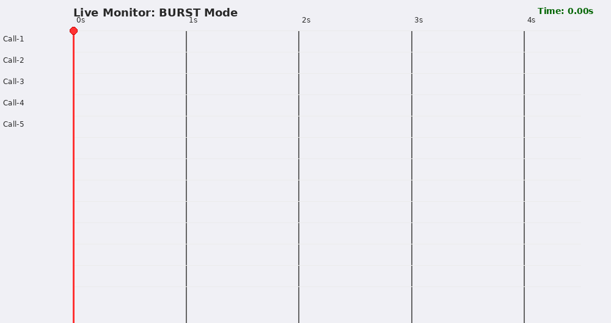
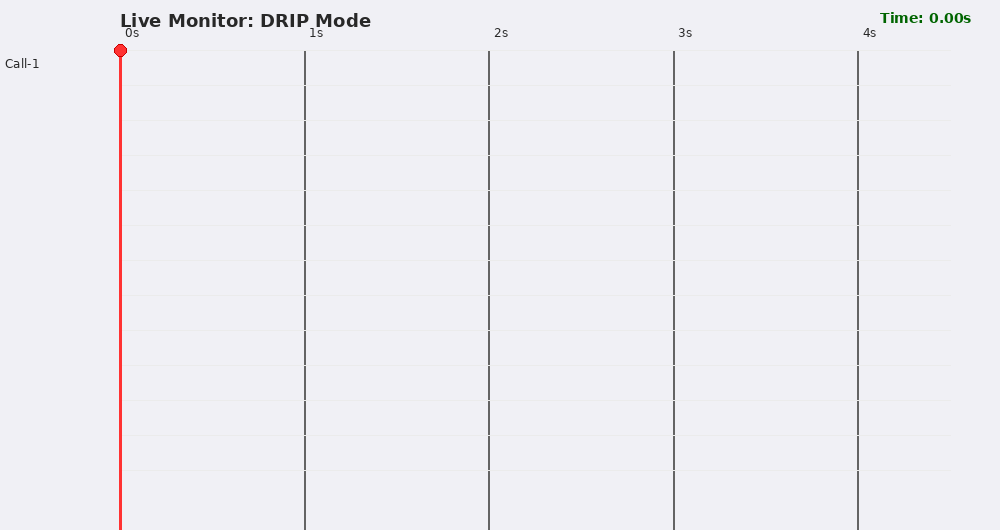

# Call limiter Burst Mode

## Burst Mode
If Enabled by setting all_burst parameter `allow_burst=True` all calls allowed in the period will be
fired instantly.

If Disabled by setting all_burst parameter `allow_burst=False` all calls allowed in the period will be
fired by spreading evenly in the period.

